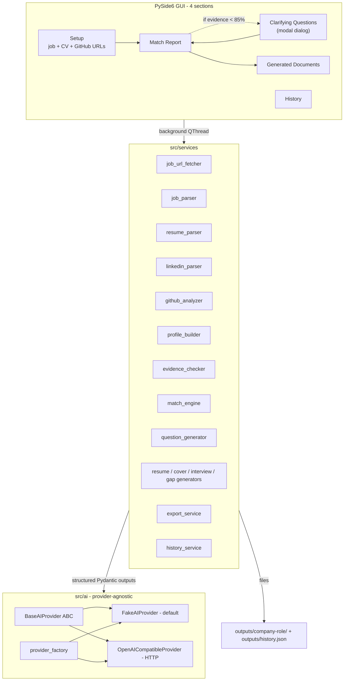

# ApplyPilot AI

> **Job URL to Tailored Resume & Cover Letter**

ApplyPilot AI is a Python desktop GenAI application that turns a job posting URL, resume, GitHub profile and LinkedIn export into a tailored ATS-friendly resume and cover letter. It uses **evidence-based generation**, **clarifying questions** and **structured AI outputs** to avoid hallucinated experience. The app supports a **provider-agnostic AI API architecture** and includes a **fake/demo provider** for local testing without API costs.

| Status | Functional MVP | Default mode | Offline (FakeAIProvider) |
| --- | --- | --- | --- |
| Tested on | Python 3.11 / 3.12 / 3.13, Windows / macOS / Linux | Cost when running demos | $0 |

> Screenshots placeholder - drop your own captures into `docs/screenshots/`:
>
> - `docs/screenshots/welcome.png`
> - `docs/screenshots/job_input.png`
> - `docs/screenshots/match_report.png`
> - `docs/screenshots/documents.png`

---

## Table of contents

1. [What it does](#what-it-does)
2. [Why it exists](#why-it-exists)
3. [Tech stack](#tech-stack)
4. [Architecture](#architecture)
5. [GenAI features](#genai-features)
6. [No hallucinated experience policy](#no-hallucinated-experience-policy)
7. [AI provider architecture](#ai-provider-architecture)
8. [Fake / demo mode (no API key needed)](#fake--demo-mode-no-api-key-needed)
9. [Installation](#installation)
10. [Running the app](#running-the-app)
11. [Configuring `.env`](#configuring-env)
12. [Workflow walkthrough](#workflow-walkthrough)
13. [Project structure](#project-structure)
14. [Outputs](#outputs)
15. [Tests](#tests)
16. [Limitations](#limitations)
17. [Roadmap](#roadmap)
18. [GitHub push instructions](#github-push-instructions)
19. [License](#license)

---

## What it does

You paste a job URL (or the description text), drop your CV, optionally add your LinkedIn export and GitHub username, and the app produces:

- A **tailored ATS-friendly resume** that reorders your skills and projects for this specific role.
- A **cover letter** that mentions the company and role concretely (no generic templates).
- A **match report** with overall and category scores, matched / missing requirements, ATS keyword coverage and recommended improvements.
- **Interview preparation** - 10 likely questions with rationale and suggested answers grounded in your profile.
- A **skill gap plan** with importance, learning path and a suggested side project for each gap.
- An **evidence report** (JSON) listing every claim and where it came from.
- A single-page **HTML application summary** that bundles everything for review.

All outputs are editable in-app before export and are written to `outputs/<company>-<role>-<timestamp>/`.

## Why it exists

Most AI resume tools either invent experience you do not have or produce generic outputs that do not match the posting. ApplyPilot AI is built around two opinionated choices:

1. **No hallucinated experience.** Every claim in the resume must trace back to evidence the candidate actually provided (CV / LinkedIn / GitHub / answered clarifying questions).
2. **No vendor lock-in.** Use any LLM provider that speaks the OpenAI HTTP protocol - or no provider at all in offline demo mode.

It is also a portfolio project for QA / Junior Python / Junior AI roles, so the architecture is intentionally readable and tested.

## Tech stack

| Layer | Choice | Why |
| --- | --- | --- |
| Language | Python 3.11+ | type hints, async-friendly, Pydantic v2 |
| GUI | **PySide6** (LGPL-3.0) | first-class Qt bindings, no GPL contagion |
| Theme | Centralised QSS in `src/gui/theme.py` | one place to tweak the dark UI tokens |
| Data validation | Pydantic v2 | structured AI outputs + strict typing |
| AI HTTP | `requests` only | works with every OpenAI-compatible endpoint |
| Job URL fetch | `trafilatura`, `requests` + `beautifulsoup4` | best signal-to-noise on job pages |
| CV/DOCX | `pymupdf`, `python-docx` | robust PDF + DOCX parsing |
| Markdown | `markdown` | renders the application summary HTML |
| Tests | `pytest` | hermetic, never touches the network |
| Config | `python-dotenv` | one `.env` file for everything |

## Architecture



**Key principle:** the GUI never calls AI directly. Every AI call goes through `services/*` which work with Pydantic models, so business logic is testable without a window manager.

## GenAI features

- **Role-aware persona prompts.** The AI is told to behave like the right kind of recruiter for the detected role (e.g. "former QA lead" for QA Engineer, "head of AI" for GenAI Engineer, "head of analytics" for Data Analyst).
- **Title-based role detection.** A regex classifier in `src/ai/role_detector.py` recognises 20 distinct IT roles from job titles - QA, automation, manual QA, test, junior python, junior swe, junior AI/GenAI, data analyst, data engineer, ML, frontend, backend, fullstack, mobile, devops, SRE, security, cloud - with `other_it` and `other` fallbacks. The selected role steers the persona, the question bank and the gap plan.
- **Structured outputs.** Every AI method returns a validated Pydantic model. The HTTP provider asks the LLM for `response_format=json_schema` first, falls back to `json_object`, and finally to plain JSON-in-prompt - so it works with strict providers and looser ones alike.
- **Evidence-first resume.** Before generating the resume we run the `evidence_checker`, which buckets every required / nice-to-have / ATS keyword into evidenced / weak / missing buckets. Only evidenced (or user-confirmed) skills make it into bullets.
- **Human-in-the-loop clarifying questions.** When required-skill evidence coverage drops below 85% (or any required skill is missing), the GUI shows a `Clarifying Questions` page that lets the candidate answer with `practical_experience` / `learning_in_progress` / `omit`. Only `practical_experience` answers count as evidence; `learning_in_progress` ends up in the summary line; `omit` triggers a gap plan entry.

## No hallucinated experience policy

This project explicitly forbids:

- Inventing roles, employers, projects, certifications or skills the candidate does not have.
- Phrasing learning intentions as past experience.
- Rewriting bullet points to claim outcomes that are not in the source documents.

Allowed instead:

- Reordering and rephrasing **real** bullets so they highlight job-relevant terms.
- Adding a Summary line that mentions skills the candidate is **currently learning** (when they confirmed `learning_in_progress` in the clarifying questions).
- Surfacing skills the candidate does not have as **gap plan entries** with concrete learning paths and suggested side projects.

The `EvidenceItem` Pydantic model carries a `claim`, `source_type`, `source_name`, `evidence_text` and `confidence` for every important claim, so you can audit each line of the resume back to its source.

## AI provider architecture

ApplyPilot AI talks to AI providers through a single HTTP class, `OpenAICompatibleProvider`. Every modern LLM provider exposes the same `POST /v1/chat/completions` endpoint with `messages`, `model`, `temperature` and `response_format`. By building against this de-facto standard we get full provider freedom with zero SDK dependencies.

Switching providers is purely a `.env` change:

| Provider | `AI_BASE_URL` | Example `AI_MODEL` | Notes |
| --- | --- | --- | --- |
| **OpenAI** | `https://api.openai.com/v1` | `gpt-4o-mini` | full json_schema support |
| **Groq** (free tier) | `https://api.groq.com/openai/v1` | `llama-3.3-70b-versatile` | very fast |
| **Mistral** | `https://api.mistral.ai/v1` | `mistral-small-latest` | EU-hosted |
| **OpenRouter** | `https://openrouter.ai/api/v1` | `anthropic/claude-3.5-sonnet` | one key, many models |
| **DeepSeek** | `https://api.deepseek.com/v1` | `deepseek-chat` | low cost |
| **Together AI** | `https://api.together.xyz/v1` | `meta-llama/Llama-3-70b-chat-hf` | open-weights catalogue |
| **Anthropic** | OpenAI-compat endpoint | `claude-3-5-sonnet-20241022` | requires the OAI-compat enabled token |
| **Gemini** | OpenAI-compat endpoint | `gemini-1.5-flash` | preview API |
| **Ollama** (local) | `http://localhost:11434/v1` | `llama3.1` | offline, free |
| **LM Studio** (local) | `http://localhost:1234/v1` | the model you loaded | offline, free |

Adding a brand-new provider is *zero code* - it is a `.env` change.

## Fake / demo mode (no API key needed)

If `AI_PROVIDER=fake` (the default) or `AI_API_KEY` is empty, the app uses `FakeAIProvider` instead. The fake provider:

- runs entirely **offline** (no network),
- is **deterministic** - the same input produces the same output, which makes the test suite stable,
- adapts to the **detected role** (a QA job gets QA-flavoured demo data, a Junior Python job gets dev-flavoured data, etc.),
- uses the **real candidate inputs** when present (it really pulls Python/Selenium/Jira mentions out of your CV text), so the GUI looks like it actually understands you - even without an LLM.

The Welcome screen has a **Try with sample data** button that pre-fills the demo CV, LinkedIn and GitHub fields so you can click straight through to a finished application package.

## Installation

```bash
# Clone (after the repository exists)
git clone https://github.com/Fearplay/applypilot-ai.git
cd applypilot-ai

# Create + activate a virtual env
python -m venv .venv
.venv\Scripts\activate          # Windows PowerShell
# source .venv/bin/activate     # Linux / macOS

# Install runtime + dev dependencies
pip install -r requirements.txt
```

Tested on Python **3.11**, **3.12** and **3.13**.

## Running the app

```bash
python app.py
```

The first thing you see is the Welcome screen with a coloured banner at the top:

- **Amber banner** = you are in `FakeAIProvider` demo mode (no API calls, free).
- **Green banner** = a real provider is active (`OpenAICompatibleProvider` will hit your endpoint).

You can switch providers at runtime via **File > AI provider settings...** (Ctrl+,).

## Configuring `.env`

Copy the template and edit it:

```bash
copy .env.example .env          # Windows
# cp .env.example .env          # Linux / macOS
```

Minimum keys to switch on a real provider:

```env
AI_PROVIDER=openai_compatible
AI_BASE_URL=https://api.openai.com/v1
AI_API_KEY=sk-...
AI_MODEL=gpt-4o-mini
```

`.env` is git-ignored, so your key never leaks. Every real AI call is also logged to `logs/ai_requests.log` (toggle via `AI_REQUEST_LOG=true|false`).

> **GitHub:** paste your **profile URL** (`https://github.com/your-username`) into the Setup page and the app fetches your public repositories from the GitHub REST API. Optionally set `GITHUB_TOKEN` in `.env` to lift the rate limit from 60 req/h (anonymous) to 5000 req/h. Tick *Skip GitHub* in the Setup card if you don't want any network call to github.com.

## Workflow walkthrough

The UI is now a single-window dashboard with four sections in the left sidebar. The active provider is shown as a small chip in the header (orange "Demo" or green "Live AI").

1. **Setup** - one scrollable page with three cards:
   - *Job posting* - URL fetch (uses `trafilatura` then `requests + BeautifulSoup`) or paste the text directly.
   - *Resume & profile* - drop your CV (PDF / DOCX / TXT) and optionally a LinkedIn export.
   - *GitHub profile* - paste a profile URL like `https://github.com/your-username` (or just the bare username); the app extracts the login and fetches your public repos via the GitHub REST API. Tick *Skip GitHub* to disable the network call entirely.

   Click **Run analysis** at the bottom to fire the whole pipeline (job parse + GitHub fetch + profile build + match) in one go.

2. **Clarifying questions** - if required-skill evidence coverage drops below 85%, a modal dialog appears. For each question pick *practical experience*, *learning in progress* or *no - not yet*. Click **Continue analysis** and the match report refreshes.

3. **Match report** - score badge, four category bars, three columns (matched / missing / ATS) and an evidence preview. Click **Generate documents**.

4. **Documents** - tabs for resume, cover letter, match report, interview prep, skill gap plan and evidence report. Edit the text inline. Use the per-tab **Export MD / HTML / DOCX** buttons or click **Save full analysis** to write all 9 artefacts to `outputs/<company>-<role>-<timestamp>/`.

5. **History** - the History tab loads `outputs/history.json` and lets you reopen any past output folder. Empty state shows a hint when there are no analyses yet.

## Project structure

```
applypilot-ai/
  README.md, LICENSE, requirements.txt, pyproject.toml
  .env.example, .gitignore
  app.py                    # entry point: python app.py
  src/
    config.py               # dotenv loader, Settings dataclass
    gui/                    # PySide6 main window + 4 sections + widgets + workers + theme
      theme.py              # centralised dark QSS + colour tokens
      main_window.py        # sidebar + header + section stack
      setup_page.py         # job + CV + GitHub URLs (one screen)
      match_report_page.py
      documents_page.py
      history_page.py
      questions_dialog.py   # modal clarifying-questions dialog
      widgets/              # Sidebar, StatusChip, SectionCard, FileDropZone, ScoreBadge, EvidenceCard
    ai/
      base.py               # BaseAIProvider ABC
      fake_provider.py      # offline demo provider, default
      openai_compatible_provider.py
      provider_factory.py   # graceful fallback
      prompts.py            # role-aware system + user prompts
      role_detector.py      # title -> RoleType classifier
    services/               # business logic: fetchers, parsers, generators, exporters, history
                            # github_analyzer.py - REST API for the candidate's public repos
    models/                 # Pydantic schemas (job, candidate, evidence, match, documents, package)
    storage/file_history.py # outputs/history.json reader + writer
    utils/                  # text_cleaning, file_utils, slugify, privacy, logging_config
  tests/                    # 64 pytest tests; never call real AI
  sample_data/              # anonymised CV, LinkedIn, JD and GitHub username
  outputs/                  # user-generated outputs, .gitignored except .gitkeep
```

## Outputs

For one application the export service writes nine files into one folder:

```
outputs/democorp-qa-automation-engineer-20260501-191500/
  tailored_resume.md
  tailored_resume.docx
  cover_letter.md
  cover_letter.docx
  match_report.md
  interview_questions.md
  skill_gap_plan.md
  evidence_report.json
  application_summary.html
```

Plus a single shared file:

```
outputs/history.json
```

Each history entry stores `date`, `company`, `role`, `job_url`, `match_score`, `output_folder` and `role_type`.

## Tests

```bash
pytest -q
```

The test suite is hermetic. An autouse pytest fixture replaces `requests.post` with a function that fails the test loudly if anything tries to call a real AI provider. The 64 tests cover:

- All 8 `FakeAIProvider` methods returning valid Pydantic models.
- 21 `RoleType` detector cases for IT roles + a non-IT fallback.
- Resume / DOCX / TXT parser happy and error paths.
- Evidence checker bucketing logic.
- `match_engine.compute_match` and `needs_clarifying_questions`.
- Export service writing all 9 files.
- Provider factory falling back to fake when the API key is missing.
- A guard test that asserts the safety net actually blocks an attempted real-AI call.

## Limitations

- **JavaScript-heavy job sites** (LinkedIn job posts, some ATS pages) may not render via `trafilatura` / `requests`. The app falls back to a manual paste box. A Playwright renderer is on the roadmap; the fetcher already exposes `register_renderer()` so you can plug it in.
- **PDF resumes that are scanned images** cannot be parsed (no OCR yet).
- **Demo mode is deterministic, not magical.** It produces realistic placeholder content but cannot reason about your CV the way an LLM can. Switch to a real provider for production-quality output.
- **No telemetry.** No data leaves your machine in demo mode. With a real provider, your prompts go to whichever endpoint you configured in `.env`.

## Roadmap

- [ ] Optional Playwright renderer for JS-heavy job pages.
- [ ] OCR fallback for scanned PDF resumes (Tesseract).
- [ ] Local vector store for cross-application evidence search.
- [ ] Browser extension that sends the current LinkedIn job URL to the desktop app.
- [ ] Per-language localisation of the cover letter (EN / CS / DE).
- [ ] PyInstaller / Nuitka standalone builds.
- [ ] CI: GitHub Actions matrix (Windows / macOS / Linux x Python 3.11 / 3.12 / 3.13).

## GitHub push instructions

If you want to publish your fork:

```bash
git init                        # only if the repo is not already git-initialised
git add .
git commit -m "Initial commit - ApplyPilot AI MVP"
git remote add origin https://github.com/<your-user>/applypilot-ai.git
git branch -M main
git push -u origin main
```

If the remote already exists:

```bash
git remote set-url origin https://github.com/<your-user>/applypilot-ai.git
git branch -M main
git push -u origin main
```

The MVP scaffold was developed on `feat/initial-mvp-scaffold` (PR #1, merged into `main`). The current modern UI redesign and GitHub-without-REST rework live on `feat/modern-ui` and target `main` directly. See `git log --graph --oneline` for the per-commit history.

## License

This project is licensed under the **MIT License** - see [`LICENSE`](LICENSE) for details.

### Third-party licences

- **PySide6** is licensed under the **GNU LGPL-3.0**. ApplyPilot AI links against PySide6 dynamically and does not modify it, which is permitted by the LGPL. If you redistribute the application, you must keep PySide6 dynamically linked or comply with the LGPL terms (which usually means shipping it as a separate library that the user can replace).
- All other dependencies are MIT, BSD or Apache 2.0 licensed - see `requirements.txt`.
